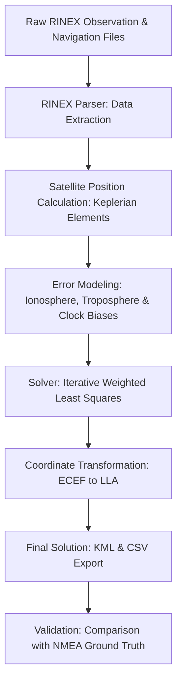

# GNSS Position Estimation from Raw RINEX Data

## Introduction

This repository provides a complete Python-based solution for calculating precise receiver positions from raw Global Navigation Satellite System (GNSS) data. Developed as part of a GNSS course assignment, the project implements the full pipeline of satellite navigation: from parsing RINEX observation and navigation files to applying atmospheric corrections, solving the navigation equations using Weighted Least Squares (WLS), and validating the results against NMEA ground truth.

The primary goal is to demonstrate a deep understanding of the mathematical models behind GNSS, including satellite orbit determination, pseudorange error modeling, and iterative position estimation.

---

## 🛠 Project Structure & Logic

1. **`main.py`**
   The entry point of the application. It orchestrates the flow between parsing, solving, and outputting results. It initializes the processing parameters and loops through the observation epochs to compute a time-series of positions.

2. **`rinex_parser.py`**
   Handles the ingestion of RINEX (Receiver Independent Exchange Format) files.
   * **Observation Data:** Extracts pseudoranges, carrier phase, and Doppler measurements.
   * **Navigation Data:** Parses ephemeris parameters (Keplerian elements) required to calculate satellite positions at specific timestamps.
   * **Logic:** Uses efficient data structures to map observations to the correct satellite ephemeris.

3. **`satellite_position.py`**
   Implements the algorithms to calculate the ECEF (Earth-Centered, Earth-Fixed) coordinates of satellites.
   * **Algorithm:** Uses the broadcast ephemeris parameters to solve Kepler's equation iteratively.
   * **Earth Rotation:** Corrects for the Sagnac effect (Earth rotation during signal transit time).

4. **`corrections.py`**
   A critical module for achieving accuracy. It computes and applies:
   * **Satellite Clock Bias:** Calculated using polynomial coefficients from the navigation message, including relativistic effects.
   * **Tropospheric Delay:** Implements models (like Saastamoinen or simple mapping functions) to estimate delay based on satellite elevation and receiver altitude.
   * **Ionospheric Delay:** Implements the Klobuchar model using parameters from the RINEX header.

5. **`solver.py`**
   The mathematical heart of the repo.
   * **Algorithm:** Implements Weighted Least Squares (WLS).
   * **Process:** Linearizes the non-linear pseudorange equations around an initial guess and iteratively solves for $\Delta X, \Delta Y, \Delta Z$ and the receiver clock bias $\delta t_r$.
   * **Weighting:** Satellites are weighted based on their elevation angle, as low-elevation satellites typically suffer from higher multipath and atmospheric noise.

6. **`nmea_parser.py`**
   Parses `.nmea` files (usually from high-end receivers) to serve as a "Ground Truth" for error analysis. It allows the system to calculate the Root Mean Square Error (RMSE) of the computed solution.

7. **`output.py`**
   Handles data export. It generates `.csv` files for analysis and `.kml` files for visualization in Google Earth, allowing for a visual path comparison.

---

## 🛰 GNSS Algorithm Details

### Clock Biases & Relativistic Effects
The satellite clock is not perfectly synchronized with GPS time. We calculate the correction:

$$ \Delta t_{sv} = a_{f0} + a_{f1}(t - t_{oc}) + a_{f2}(t - t_{oc})^2 + \Delta t_{rel} $$

Where $\Delta t_{rel}$ accounts for general relativity due to orbit eccentricity.

### Atmospheric & Altitude Errors
* **Troposphere:** Modeled as a function of the satellite elevation angle and receiver altitude to compensate for signal delay in the neutral atmosphere.
* **Ionosphere:** Corrected using the Klobuchar model parameters provided in the navigation file to account for dispersive delays in the ionized upper atmosphere.

### Satellite Filtering & Validation
To ensure a robust solution, the code performs:
* **Elevation Masking:** Satellites below a certain threshold (e.g., 10-15 degrees) are excluded to minimize noise.
* **DOP Analysis:** Calculations of Dilution of Precision (GDOP, PDOP) to assess the geometric strength of the satellite constellation.
* **Residual Checking:** Identifies and removes "outlier" measurements that don't fit the mathematical model.

---

## 🔄 Processing Pipeline



---

## 📚 References

This project was built with reference to the following high-quality GNSS resources:
* **gnss_lib_py:** A modular GNSS library that provided insights into efficient RINEX handling and WLS implementation.
* **RTKLIB:** The industry standard for open-source GNSS processing.

---

## 🚀 Build & Run Instructions

### Prerequisites
* Python 3.8+
* Recommended virtual environment:
  ```bash
  python -m venv venv
  source venv/bin/activate  # On Windows: venv\Scripts\activate
  ```

### Installation & Execution
```bash
git clone https://github.com/Eladi24/GNSS_EX0.git
cd gnss-assignment
pip install -r requirements.txt
python3 main.py
```
*(Note: File paths are currently configured inside `main.py`.)*

Your results will be generated in the `output/` directory.